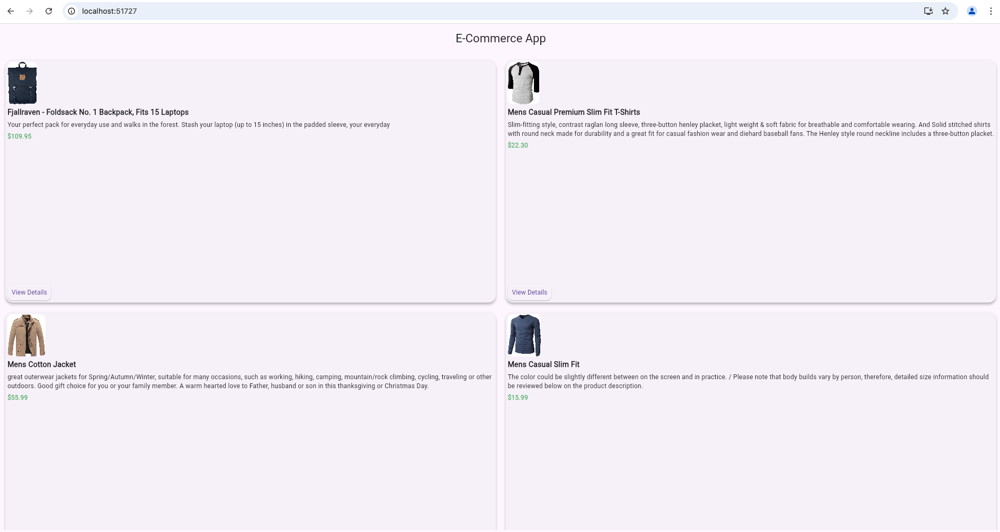

# ecommerce_catalog

[E-Commerce App]


## To Run
```
flutter run or 
flutter run - chrome
```

## To deploy to firebase

```
flutter build web
```
content of public/index.hmml to be copied to build/web/index.html

```
firebase deploy
```
p.s. firebase.json has been updated for the public folder to build/web
"public": "build/web",

Application can be access at

https://ecommerce-catalog-9547a.web.app/
